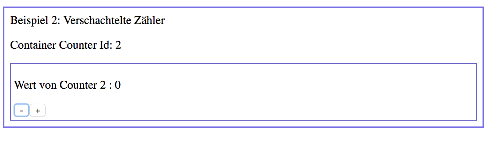
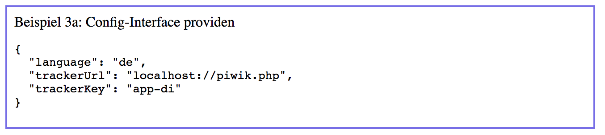
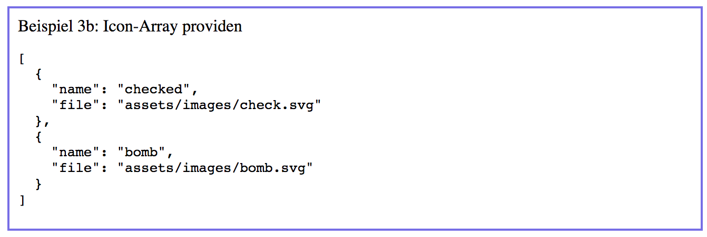
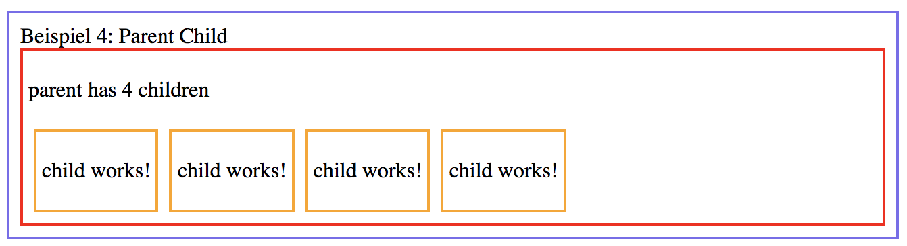

# Dependency Injection

angular bietet ein Dpendency Injection (DI) Framework. Die grundlegende Funktion ist hier beschrieben: [https://angular.io/guide/dependency-injection](https://angular.io/guide/dependency-injection)

## Einführung

### Was ist DI

Dependency Injection ist ein Softwar Design Pattern. Es wurde
2005 von Martin Fowler vorgestellt.

Die Grundidee: Anstatt dass eine Klasse Abhängigkeiten selbst erzeugt
und verwaltet, wird diese Aufgabe in eine zentrale Komponente ausgelagert. Diese Komponente nennt man *injector*.


### Wie funktioniert DI in angular

Das DI Framework von angular besteht (vereinfacht gesagt) aus drei Teilen
* Deklaration von Abhängigkeiten
* Registrierung von injizierbaren Abhäbngigkeiten
* einen hierarchischen Injektor


In angular können folgende Features das DI Framework nutzen:
* @NgModule
* @Component
* @Pipe
* @Directive
* @Injectable

Jedes der obigen Features kann in seinem Konstruktor Abhängigkeiten definieren.
Eine Abhängigkeit muss immer eine Klasse oder ein *Injection Token* sein. Letzteres
erlaubt es, z.B. als Interfaces typisierte JSON Datenstrukturen zu injection
(doch dazu später mehr)

Damit angular weiss, welche Objekte injizierbar sind, müssen diese
zunächst beim DI Framework registriert werden. Dies geschieht in den providers-Blöcken folgender
Features:
* @NgModule
* @Component
* @Directive

Die @Component ist eine Ausnahme, hier existiert neben den *providers* mit *viewProviders*
noch ein zweiter Block, der Abhängigkeiten nur einer Komponente und ihren view-Children
bereitstellt, nicht aber content-Children.


## Beispiele

Wir erstellen eine Anwendung, die einen Zähler und Eltern-/ Kind Beziehungen am Beispiel der Dependency Injection verdeutlicht.

### Beispiel 1: Counter Service

Der wohl meistgebrauchte Weg, eine Abhängigkeit bereitzustellen, ist über einen Service.
Services werden mit @Injectable bei der DI registriert und in einem providers-Block bereitgestellt.

Wir erzeugen einen Service über die CLI mit

```bash
ng g service counter
```

bzw in der Kurzform

```bash
ng g s counter
```

und wir erhalten folgenden Service:

```typescript
import { Injectable } from '@angular/core';

@Injectable({
  providedIn: 'root'
})
export class CounterService {

  constructor() { }
}
```

seit angular 6 wird ein Service automatisch im Modul der root-Component bereitgestellt.
Wünscht man dies nicht, muss ein Service im providers-Block bereitgestellt werden.

* der @Injectable Dekorator sagt angular, dass die nachfolgende Klasse dem DI Injector zur Verfügung steht
* seit angular6 gibt es providedIn, die CLI setzt dies auf 'root'
* Services lassen sich beliebig oft providen.
Der Injector ermittelt mittels Backtracking die hierarchisch zuletzt bereitgestellte Instanz eines Services
* Der Injektor unterstützt keine zyklischen Abhängigkeiten

Alternativ kann das App-Module, oder einem eigenes *Service-Module*, den Service bereitstellen:

```typescript
  providers: [
    // hier providen wir den Service im App-Module
    CounterService
  ],
```

oder

```typescript
  providers: [
    // das Feature-Module stellt einen Service bereit
    CounterService
  ]
})
export class CounterModule { }
```

### Beispiel 2: Services über Komponenten bereitstellen

angular erlaubt es, Services in einer Komponente bereitzustellen. Und zwar entweder per providers oder viewProviders. Der Unterschied ist dann bedeutend, wenn eine Komponente [ContentChildren](https://angular.io/api/core/ContentChildren) verwendet.

```html
Beispiel 2: Verschachtelte Zähler
<app-counter-container>
    <app-counter-panel></app-counter-panel>
</app-counter-container>
```

im obigen Beispiel ist der *app-counter-panel* ein Content-Child von *app-counter-container* , weil es zwischen den öffnenden und schließenden Tag steht.

Wir providen den Counter-Service zunächst im providers-Block der Komponente und sehen folgendes Ergebnis:



Obwohl *app-counter-panel* im Template der App-Component erzeugt wird, erhält es den CounterService von app-counter-container.

Um zu verhindern, dass eine Komponente Services von Content-Children überschreibt, gibt es den *viewProviders* Block:


### Beispiel 3a: Beliebige Objekte und Interfaces bereitstellen

Im Standard-Fall wird eine Klasse als Service bei angular registriert. Daneben gibt es noch die Möglichkeit, beliebige Datentypen oder Interfaces bereitzustellen.

Oftmals wollen wir aber keinen Service bereitstellen, sondern Daten (zum Beispiel ein Konfigurationsobjekt oder ähnliches). Ebenso muss eine Abhängigkeit mit mehreren Varianten gleichzeitig bereitgestellt werden.

Hierzu bietet angular 2 Konstrukte, um den Injector zu konfigurieren:
* den [Provider Typen](https://angular.io/api/core/Provider)
* das [Injection Token](https://angular.io/api/core/InjectionToken)
* den [@Inject Decorator](https://angular.io/api/core/Inject)

Im Beispiel hinterlegen für unsere Testanwendung eine statische Konfiguration. Zu dieser Konfiguration gibt es ein Interface, womit der Injector erstmal nicht arbeiten kann (da es zur Laufzeit nicht existiert).

```typescript
export interface Config {
  language: 'de' | 'en' | 'da';
  trackerUrl: string;
  trackerKey: string;
}
```

Um das Interface dem Injektor bekannt zu geben, erzeugen wir ein Injection-Token:

```typescript
const BASE_URL = new InjectionToken<string>('BaseUrl');
```

Und tragen im App-Module eine Konfiguration ein. Hierzu deklarieren wir ein providers-Objekt für einen valueProvier:

```typescript

```

In der App-Component können wir jetzt mittels [@Inject](https://angular.io/api/core/Inject) den Wert von CONFIG injecten:

```typescript
constructor(public counterService: CounterService,
    @Inject(CONFIG) public config: Config,
```

Wir erhalten somit folgende Ausgabe:


### Beispiel 3b: Tokens mehrfach bereitstellen

Soll ein Token ein Array von Werten haben (Beispiel: mehrere Http-Interceptoren, usw), können wir im provide-Interface das Flag *multi* auf true setzen. In dem Fall stellt angular alle provides eines Tokens als Array bereit. Im Beispiel-Code verwenden wir hierzu ein fiktives Icon-Interface.

Somit führt ein
```typescript
{
  provide: ICON,
  useValue: <Icon>{
    name: 'checked',
    file: 'assets/images/check.svg'
  },
  multi: true
},
{
  provide: ICON,
  useValue: <Icon>{
    name: 'bomb',
    file: 'assets/images/bomb.svg'
  },
  multi: true
}
```

zu


### Beispiel 4: Eltern-Komponenten injecten

Der Injector von angular arbeitet hierarchisch. Das bedeutet, dass man neben Services auch alle Vorgänger-Komponenten im DOM per DI injecten lassen kann.

Im Beispiel haben wir Parent und Child Komponenten. Jedes Child erhält Zugriff auf sein Parent und registriert sich (was einen Zähler im Parent erhöht). Komponenten sind somit auch über die DI verfügbar:

```typescript
export class ChildComponent implements OnInit, OnDestroy {

  constructor(private parent: ParentComponent) { }

  ngOnInit() {
    this.parent.registerChild();
  }

  ngOnDestroy() {
    this.parent.unregisterChild();
  }
}
```




ACHTUNG: diese Art der Injection funktioniert nur in eine Richtung. Zudem kann eine Parent-Component ihre Child-Components nicht mehr programmatisch als Content-Children über QueryLists erfassen (zyklische Abhängigkeit).

TIP: realisiert Eltern-Kind Kommunikation über @Input / @Output oder Services.

## Ausblick

Wir haben die grundlegenden Funktionen des DI Mechanismus dargestellt. Das umfasst aber DI noch nicht vollständig. In einer aufbauenden Session betrachten wir
* DI in NgModules
* Konfiguration von NgModule mit forRoot, forChild
* Injector programmatisch nutzen
